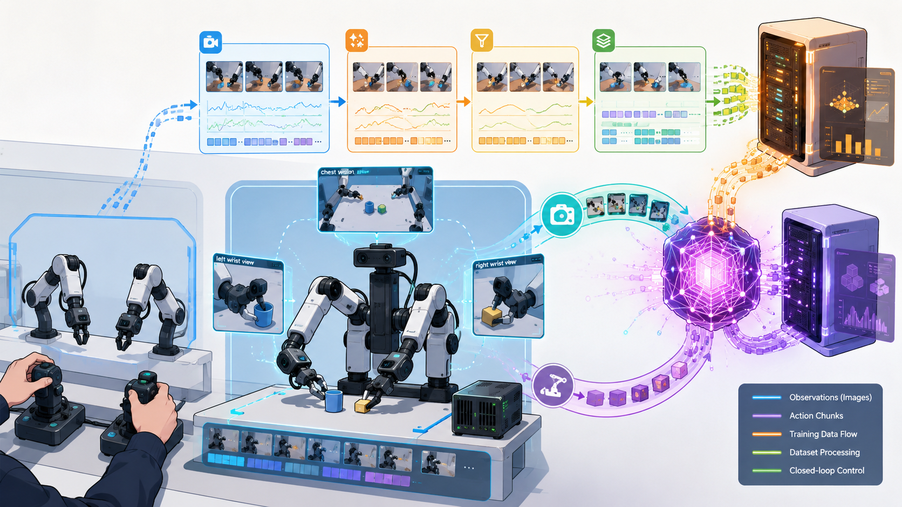
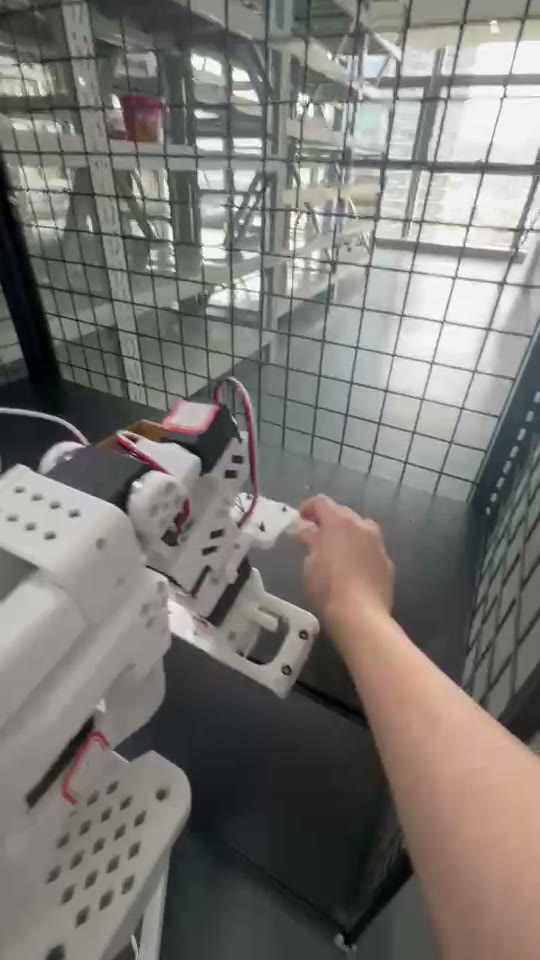
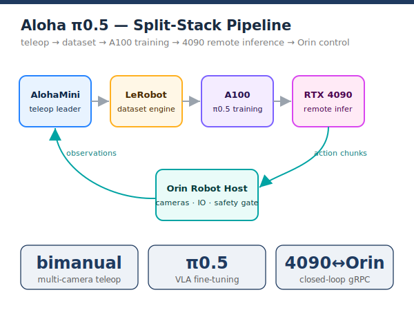
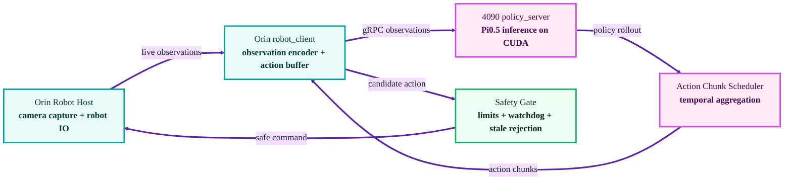

<div align="center">

# Aloha Pi0.5 LeRobot



[](https://github.com/liangjlei/personalwebsite/tree/main/projects/aloha-pi05-lerobot)
[](pyproject.toml)
[](LICENSE)
[](https://github.com/huggingface/lerobot)
[](docs/hardware_setup.md)
[](docs/train_pi05_a100.md)
[](docs/remote_inference_4090_orin.md)

**A real-robot learning pipeline for AlohaMini teleoperation, LeRobot-format
datasets, A100 Pi0.5 training, and 4090-to-Orin remote closed-loop inference.**

</div>

**Jinglei Liang** &middot; Real-robot systems / VLA, 2026

This project is an engineering extension built from the AlohaMini real-robot
project and Hugging Face [LeRobot](https://github.com/huggingface/lerobot).
It adapts a general robot learning framework into a real Aloha manipulation
pipeline for teleoperation, dataset collection, dataset cleaning, Pi0.5
training, remote GPU inference, and closed-loop robot control.

## Demo Video

<!--
  PLACEHOLDER FOR DEMO VIDEO.
  A local clip is committed at ../../assets/demo/aloha_pi05_demo.mp4 (and .mov).
  GitHub does not autoplay relative video files inside a README, so the poster
  below links to the raw clip. To embed an inline player on github.com instead,
  drag-and-drop the video into the GitHub web editor for this file and replace
  the block below with the user-images URL it generates — or swap in a
  YouTube / Bilibili link.
-->

<div align="center">

[](../../assets/demo/aloha_pi05_demo.mp4)

▶ **[Watch the demo video](../../assets/demo/aloha_pi05_demo.mp4)** &middot;
[download MOV](../../assets/demo/aloha_pi05_demo.mov)

</div>

<video src="../../assets/demo/aloha_pi05_demo.mp4" poster="../../assets/demo/aloha_pi05_poster.jpg" controls width="640"></video>

## Abstract

We present an end-to-end real-robot learning system that adapts LeRobot from a
general robot learning framework into a distributed Aloha manipulation stack.
The system uses AlohaMini leader arms for bimanual teleoperation, collects
multi-camera AlohaPro demonstrations in LeRobot format, cleans and merges
real-robot episodes, trains Pi0.5 vision-language-action policies on an A100
server, and deploys large checkpoints through a remote RTX 4090 inference
server while the Orin robot host keeps low-level control and safety loops close
to the hardware. The result is a practical bridge from demonstration collection
to large-model closed-loop manipulation on real robots.

## System Highlights

| Highlight | What It Enables |
| --- | --- |
| AlohaMini-to-AlohaPro teleoperation | Collect bimanual real-robot demonstrations with leader arms and synchronized cameras. |
| LeRobot dataset pipeline | Record, visualize, clean, delete bad episodes, merge datasets, and prepare training-ready data. |
| A100 Pi0.5 training | Fine-tune large VLA policies with bf16, gradient checkpointing, and reproducible training templates. |
| 4090 remote inference | Run large Pi0.5 checkpoints off-board when Orin cannot host the full policy. |
| Orin closed-loop control | Keep camera capture, action validation, watchdogs, and robot IO on the real robot host. |
| Public release hygiene | Share code, docs, and templates without leaking datasets, weights, IPs, SSH paths, or hardware serials. |

## What This Project Can Do

- Use AlohaMini-style bimanual leader arms to teleoperate an AlohaPro-style
  robot.
- Record real-robot manipulation episodes in LeRobot dataset format.
- Visualize, clean, delete bad episodes, merge datasets, and prepare training
  data.
- Train Pi0.5 policies on an A100 server with bf16 and gradient checkpointing.
- Export trained checkpoints as `pretrained_model` directories.
- Run Pi0.5 inference on a remote RTX 4090 server when the model is too large
  for Orin.
- Let the Orin robot host keep low-level robot IO, camera capture, watchdogs,
  and safety checks while receiving action chunks from the 4090 policy server.

## System Overview

<div align="center">



</div>

**Figure 1.** End-to-end architecture in four stages: **(a)** AlohaMini
teleoperation and LeRobot data collection, **(b)** π0.5 VLA fine-tuning on an
A100 (frozen vision–language backbone + trained action expert, flow-matching
loss), **(c)** remote closed-loop inference with the large policy served off-board
on a 4090 while the Orin host stays real-time, and **(d)** the safety gate that
clamps, validates, and rejects unsafe actions before they reach the robot.

```mermaid
%%{init: {"theme": "base", "themeVariables": {"fontSize": "16px", "fontFamily": "Inter, ui-sans-serif, system-ui", "primaryTextColor": "#102033", "lineColor": "#6B7280"}, "flowchart": {"nodeSpacing": 38, "rankSpacing": 56, "curve": "basis"}}}%%
flowchart LR
    Demo["AlohaMini<br/><b>Teleoperation</b>"]
    Runtime["AlohaPro / Orin<br/><b>Robot Runtime</b>"]
    Dataset["LeRobot<br/><b>Dataset Engine</b>"]
    Training["A100<br/><b>Pi0.5 Training</b>"]
    Inference["4090<br/><b>Remote Inference</b>"]

    Demo == "teleop" ==> Runtime
    Runtime == "episodes" ==> Dataset
    Dataset == "curated data" ==> Training
    Training == "model" ==> Inference
    Inference == "actions" ==> Runtime

    classDef demo fill:#E8F3FF,stroke:#2684FF,stroke-width:3px,color:#0B2545;
    classDef runtime fill:#E9FBF8,stroke:#00A3A3,stroke-width:3px,color:#063B3B;
    classDef dataset fill:#FFF7E6,stroke:#FFB020,stroke-width:3px,color:#4A2A00;
    classDef training fill:#F4ECFF,stroke:#7B61FF,stroke-width:3px,color:#26114D;
    classDef inference fill:#FFEAF6,stroke:#D946EF,stroke-width:3px,color:#4A044E;

    class Demo demo;
    class Runtime runtime;
    class Dataset dataset;
    class Training training;
    class Inference inference;
```



**Figure 1a.** The high-level split-stack design. The system separates
demonstration collection, dataset engineering, large-model training, remote
inference, and real-time robot safety into machine-specialized modules.

### Offline Data And Training Path

```mermaid
%%{init: {"theme": "base", "themeVariables": {"fontSize": "19px", "fontFamily": "Inter, ui-sans-serif, system-ui", "primaryTextColor": "#102033", "lineColor": "#7C5A00"}, "flowchart": {"nodeSpacing": 65, "rankSpacing": 80, "curve": "basis"}}}%%
flowchart LR
    Leader["AlohaMini<br/><b>bimanual leader arms</b>"]
    Robot["AlohaPro / Orin<br/><b>state + action + cameras</b>"]
    Record["Synchronized Recorder<br/><b>video + state + action + task</b>"]
    Clean["Dataset Curation<br/><b>visualize, delete, merge</b>"]
    Train["A100 Pi0.5 Training<br/><b>bf16 + gradient checkpointing</b>"]
    Export["Checkpoint Export<br/><b>pretrained_model</b>"]

    Leader --> Robot
    Robot --> Record
    Record --> Clean
    Clean --> Train
    Train --> Export

    classDef human fill:#E8F3FF,stroke:#2684FF,stroke-width:3px,color:#0B2545;
    classDef robot fill:#E9FBF8,stroke:#00A3A3,stroke-width:3px,color:#063B3B;
    classDef data fill:#FFF7E6,stroke:#FFB020,stroke-width:3px,color:#4A2A00;
    classDef train fill:#F4ECFF,stroke:#7B61FF,stroke-width:3px,color:#26114D;

    class Leader human;
    class Robot robot;
    class Record,Clean data;
    class Train,Export train;
```



**Figure 1b.** Offline path: human demonstrations become curated LeRobot-format
datasets, then A100 training exports a deployable Pi0.5 policy directory.

### Online Remote Inference Path



**Figure 1c.** Online path: Orin stays close to the robot hardware, while the
4090 runs the large Pi0.5 policy and streams action chunks back into a safety
gated closed loop.

| Flow | Meaning |
| --- | --- |
| Blue / teal modules | Real-time teleoperation, camera capture, robot IO, and Orin runtime. |
| Amber modules | LeRobot dataset recording, visualization, cleaning, merging, and stats. |
| Violet modules | A100 Pi0.5 training and checkpoint export. |
| Magenta modules | 4090 remote policy serving and action-chunk scheduling. |
| Green module | Safety gate before commands reach the real robot. |

The core idea is to split the system by machine capability:

- Orin: real-time robot IO, cameras, safety, and closed-loop execution.
- A100: heavy Pi0.5 training.
- RTX 4090: remote inference server for large policies.
- AlohaMini: human teleoperation interface for collecting demonstrations.

## Workflow At A Glance

| Stage | Machine | Main Entry Point | Output |
| --- | --- | --- | --- |
| Environment setup | Local / Orin / A100 / 4090 | `python -m pip install -e ".[dev]"` and editable LeRobot install | Reproducible Python workspace |
| Teleoperation host | Orin | `python -m lerobot.robots.alohamini.lekiwi_host --arm_profile am-arm-6dof` | Robot host with cameras, state, and action IO |
| Demonstration recording | Orin + AlohaMini | `python examples/alohamini/record_bi.py --dataset local/aloha_task_demo` | LeRobot-format episodes |
| Dataset cleaning | Workstation / server | `bash scripts/clean_and_merge_dataset.sh` | Curated merged dataset |
| Pi0.5 training | A100 | `bash scripts/train_pi05_a100.sh` | Trained checkpoints and `pretrained_model` export |
| Policy serving | RTX 4090 | `bash scripts/start_4090_policy_server.sh` | Remote Pi0.5 `policy_server` |
| Closed-loop inference | Orin + 4090 | `bash scripts/start_orin_robot_client.sh` | Observation-to-action remote control loop |

## Quick Navigation

- [Install Environment](#install-environment)
- [Start Data Collection](#start-data-collection)
- [Clean And Merge Datasets](#clean-and-merge-datasets)
- [Start Pi05 Training On A100](#start-pi05-training-on-a100)
- [Deploy Remote Inference On 4090](#deploy-remote-inference-on-4090)
- [Run Inference And Closed-Loop Control](#run-inference-and-closed-loop-control)
- [Safety Notes](#safety-notes)

## Repository Layout

```text
assets/                   Project cover image and public media.
configs/                  Example YAML configs with no private machine data.
docs/                     Architecture and operating guides.
examples/                 Fake/demo entry points that run without a robot.
scripts/                  Startup templates for Orin, A100, and 4090 machines.
src/aloha_lerobot/         Lightweight reusable Python helpers.
tests/                    Unit tests for action mapping and dataset tooling.
```

## Install Environment

This repository is a lightweight helper package. A real deployment also needs a
compatible LeRobot checkout and the hardware-specific robot drivers used in
your lab.

Create a Python environment:

```bash
conda create -n aloha_lerobot python=3.10 -y
conda activate aloha_lerobot
```

Install this project:

```bash
git clone https://github.com/liangjlei/personalwebsite.git
cd personalwebsite/projects/aloha-pi05-lerobot
python -m pip install -e ".[dev]"
python -m pytest
```

Install LeRobot in editable mode in your own workspace:

```bash
git clone https://github.com/huggingface/lerobot.git
cd lerobot
python -m pip install -e .
```

For robot hardware and Pi0.5 training, install the CUDA, PyTorch, camera, ZMQ,
gRPC, and LeRobot dependencies that match your machines. Keep local paths and
credentials in private config files, not in this repository.

## Start Data Collection

1. Prepare the robot-side config from the template:

```bash
cp configs/aloha_pro_orin.example.yaml configs/aloha_pro_orin.local.yaml
cp configs/aloha_mini_teleop.example.yaml configs/aloha_mini_teleop.local.yaml
```

2. Start the Orin robot host from your LeRobot/Aloha checkout. Use dry-run or
   no-follower mode first:

```bash
python -m lerobot.robots.alohamini.lekiwi_host \
  --arm_profile am-arm-6dof \
  --no_follower
```

3. Record demonstrations with a LeRobot-compatible recording script:

```bash
python examples/alohamini/record_bi.py \
  --dataset local/aloha_task_demo \
  --num_episodes 10 \
  --fps 30 \
  --episode_time 60 \
  --task_description "pick up the object and place it in the box" \
  --remote_ip 127.0.0.1 \
  --robot_id aloha_pro_orin \
  --arm_profile am-arm-6dof
```

4. Inspect the collected dataset before training:

```bash
python examples/fake_remote_inference_demo.py
```

For the full collection workflow, see `docs/data_collection.md`.

## Clean And Merge Datasets

Create a bad-episode list:

```bash
cp examples/bad_episodes.example.txt bad_episodes.txt
```

Edit `bad_episodes.txt`:

```text
aloha_task_01: 1 3 4
aloha_task_02: 0 2
aloha_task_03:
```

Run the cleaning and merging template:

```bash
SRC_ROOT=/path/to/raw_datasets \
TMP_ROOT=/path/to/clean_tmp \
OUT_ROOT=/path/to/merged_dataset \
BAD_EPISODES_FILE=bad_episodes.txt \
bash scripts/clean_and_merge_dataset.sh
```

## Start Pi0.5 Training On A100

Prepare a training config:

```bash
cp configs/train_pi05_a100.example.yaml configs/train_pi05_a100.local.yaml
```

Start training with environment variables:

```bash
CONDA_ENV=aloha_lerobot_pi05 \
LEROBOT_ROOT=/path/to/lerobot \
DATASET_REPO_ID=local/aloha_clean_dataset \
DATASET_ROOT=/path/to/datasets/aloha_clean_dataset \
PRETRAINED_PATH=/path/to/checkpoints/pi05_base \
OUTPUT_DIR=/path/to/outputs/aloha_pi05 \
JOB_NAME=aloha_pi05 \
GPUS=0,1 \
BATCH_SIZE=32 \
STEPS=50000 \
bash scripts/train_pi05_a100.sh
```

Resume training:

```bash
CONDA_ENV=aloha_lerobot_pi05 \
LEROBOT_ROOT=/path/to/lerobot \
OUTPUT_DIR=/path/to/outputs/aloha_pi05 \
GPUS=0,1 \
bash scripts/resume_pi05_a100.sh
```

The exported checkpoint should contain:

```text
config.json
model.safetensors
policy_preprocessor.json
policy_postprocessor.json
train_config.json
```

For details, see `docs/train_pi05_a100.md`.

## Deploy Remote Inference On 4090

Copy or download the exported Pi0.5 `pretrained_model` directory to the 4090
server. Then start the policy server:

```bash
CONDA_ENV=aloha_lerobot \
LEROBOT_ROOT=/path/to/lerobot \
POLICY_PATH=/path/to/exported/pretrained_model \
HOST=0.0.0.0 \
PORT=8080 \
FPS=30 \
bash scripts/start_4090_policy_server.sh
```

Check that the server is listening:

```bash
ss -tln | grep 8080
```

The server must listen on `0.0.0.0:8080` or another routable address, not only
on `127.0.0.1`.

## Run Inference And Closed-Loop Control

On the Orin robot host, start the robot host first. Then start the client that
connects to the 4090 policy server:

```bash
CONDA_ENV=aloha_lerobot \
LEROBOT_ROOT=/path/to/lerobot \
ROBOT_TYPE=lekiwi_client \
ROBOT_ID=aloha_pro_orin \
ROBOT_MODEL=alohamini2 \
ROBOT_REMOTE_IP=127.0.0.1 \
SERVER_ADDRESS=4090_HOST_OR_IP:8080 \
POLICY_TYPE=pi05 \
POLICY_PATH=/path/to/exported/pretrained_model \
TASK="pick up the object and place it in the box" \
ACTIONS_PER_CHUNK=50 \
CHUNK_SIZE_THRESHOLD=0.5 \
bash scripts/start_orin_robot_client.sh
```

Recommended startup order:

1. 4090: start `policy_server`.
2. Orin: start robot host in dry-run or no-follower mode.
3. Orin: start `robot_client`.
4. Verify observations, camera frames, action dimensions, and action chunks.
5. Enable real robot control only after the dry-run path is stable.

See `docs/remote_inference_4090_orin.md` and `docs/safety.md` before running
real hardware.

## Safety Notes

Real robot control is safety-critical. Always:

- Keep a physical emergency stop reachable.
- Validate action dimensions and joint order.
- Reject stale, `NaN`, or malformed actions.
- Clamp actions to robot-specific limits.
- Use dry-run/no-follower mode before enabling torque.
- Stop processes in this order: client, robot host, policy server.

## What Is Not Included

This repository intentionally does not include:

- Raw robot datasets, videos, or `.parquet` files.
- Pi0.5 / ACT checkpoints or `.safetensors` files.
- `wandb` runs, logs, caches, or temporary outputs.
- SSH config, private IPs, usernames, USB serial numbers, or machine paths.

Use Hugging Face Hub for shareable datasets and model checkpoints. Keep this
GitHub repository focused on public code, templates, and documentation.

## Relationship To LeRobot

This project is built on top of LeRobot ideas and APIs. LeRobot is licensed
under Apache-2.0. Files adapted from LeRobot should retain upstream copyright
and license notices where applicable.
