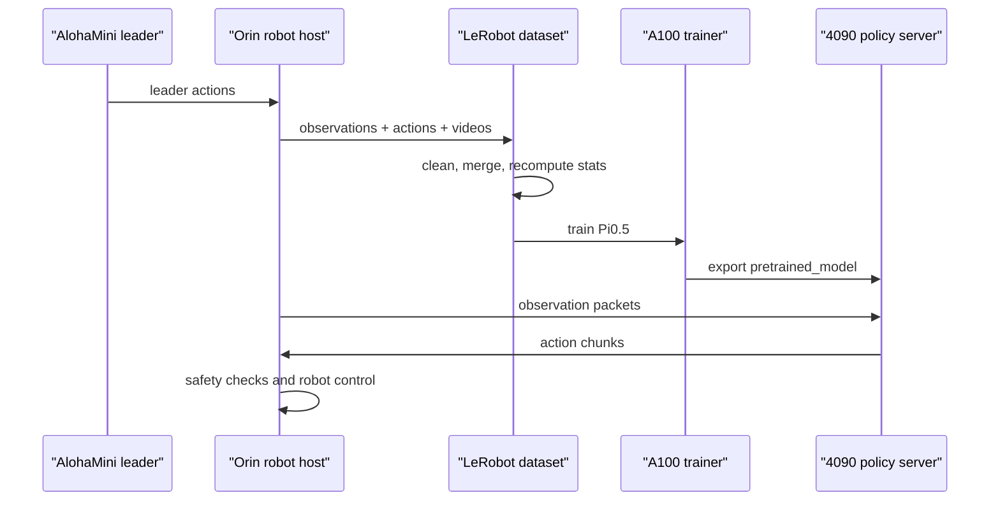

# Architecture

The project turns a general robot learning framework into a distributed
real-robot system. The important design decision is to separate the time-critical
robot loop from heavyweight model training and inference.

## Machines

| Machine | Role |
| --- | --- |
| AlohaMini station | Bimanual leader arms used for teleoperation. |
| Orin robot host | Talks to follower arms, cameras, lift/base, and safety loop. |
| A100 server | Trains Pi0.5 on LeRobot-format datasets. |
| 4090 server | Loads exported Pi0.5 checkpoints and runs remote inference. |

## Runtime Flow

## Core Interfaces

- Observations should include robot state, synchronized camera views, task text,
  and timestamps.
- Actions should use one documented joint order and one unit convention.
- Robot-side code should keep a watchdog and reject stale or invalid actions.
- GPU-side code should be stateless enough to restart without changing robot
  calibration or dataset format.

## Why Remote Inference

Pi0.5 is too large for reliable deployment on the Orin in this setup. Moving the
policy process to a 4090 keeps the robot host focused on IO and safety while
allowing larger VLA policies to run with lower latency and more memory headroom.
