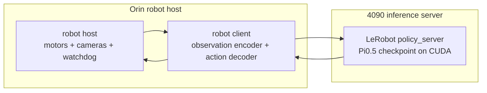

# Remote Inference: 4090 + Orin

The 4090 runs the policy server. The Orin runs the robot host and sends
observations to the server, then applies returned actions after safety checks.

## Topology



## Startup Order

1. Start the 4090 policy server with `HOST=0.0.0.0`.
2. Start the Orin robot host in dry-run or no-follower mode.
3. Start the Orin client and point it at `4090_HOST:8080`.
4. Validate one short action chunk.
5. Enable real control only after dry-run logs are clean.

## Network Checks

On the Orin:

```bash
ping 4090_HOST
nc -zv 4090_HOST 8080
```

On the 4090:

```bash
ss -tln | grep 8080
```

The server must listen on `0.0.0.0:8080` or a routable LAN address, not only on
`127.0.0.1`.

## Inference Parameters

Typical initial values:

```text
fps=30
actions_per_chunk=50
chunk_size_threshold=0.5
aggregate_fn_name=weighted_average
policy_device=cuda
client_device=cpu
```

If the client often waits for new chunks, lower `chunk_size_threshold` so the
next chunk is requested earlier.
