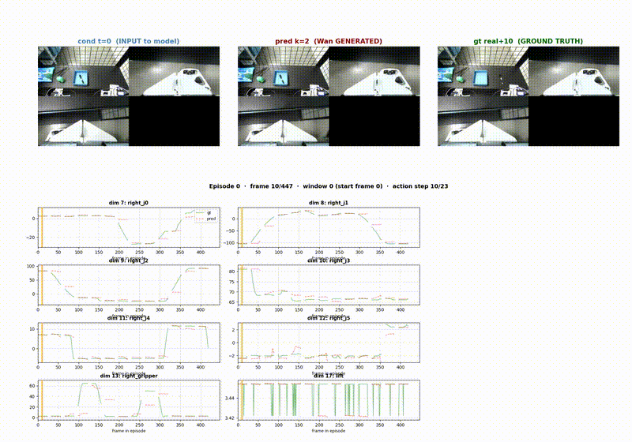
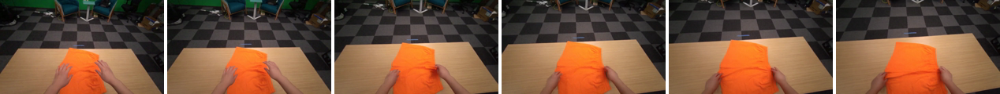

<div align="center">

# DreamZero

### An Action-Conditioned Robotic World Model for Joint Video and Action Prediction

[](https://github.com/liangjlei/personalwebsite/tree/main/projects/dreamzero-world-model)
[](#method)
[-00A3A3)](#data)
[](#method)
[](#license)

**A generative world model that, from a single conditioning frame and an action
plan, predicts both future camera observations and the robot's future joint
trajectory — turning a video-diffusion backbone into a learned simulator for
real-robot manipulation.**

</div>

**Jinglei Liang** &middot; Embodied AI / World Models, 2026


<div align="center">
  
  <br />
  <sub>Episode 0 &mdash; <b>left:</b> conditioning frame <code>t=0</code> (input) &middot; <b>middle:</b> <code>pred k=2</code> (Wan2.2-generated) &middot; <b>right:</b> ground-truth future <code>+10</code>. Bottom: predicted vs. ground-truth traces for the seven right-arm joints and gripper.</sub>
</div>

### Wan2.2 generated rollout

<div align="center">
  <video src="assets/wan22_demo.mp4" width="640" controls muted loop poster="assets/wan22_demo_poster.jpg"></video>
  <br />
  
  <br />
  <sub>A short manipulation clip generated by the Wan2.2-trained model
  (<a href="assets/wan22_demo.mp4">wan22_demo.mp4</a>). The filmstrip samples frames across the generated rollout.</sub>
</div>

---

## Overview

Vision–language–action (VLA) policies map observations to actions but cannot
*imagine* the consequences of a candidate action before committing to it.
**DreamZero** takes the complementary view: it learns the environment's forward
dynamics as a **world model**. Conditioned on the current observation and a
proposed action sequence, it generates the future the robot would see, together
with the joint-space trajectory that produces it.

Concretely, DreamZero adapts a pretrained **Wan2.2** video-diffusion transformer
into an **action-conditioned** generator and supervises it, via supervised
fine-tuning (SFT), on real-robot teleoperation data collected on an
**Aloha-LeKiwi** platform through the Hugging Face **LeRobot** stack. The result
is a single model that jointly answers two questions:

1. *What will the cameras show* a few steps into the future? (pixel prediction)
2. *What joint trajectory* realizes that future? (action prediction)

This joint formulation makes the model usable both as a **neural simulator** for
model-based planning / rollout evaluation and as a **generative dynamics prior**
for downstream policy learning.

## Why a world model

| Capability | Reactive VLA policy | DreamZero (world model) |
|---|---|---|
| Map observation → action | ✅ | ✅ (action head) |
| Predict future observations | ❌ | ✅ (video diffusion) |
| Roll out & score a candidate action *before* execution | ❌ | ✅ |
| Generate synthetic data / augmentations | ❌ | ✅ |
| Grounded in real-robot dynamics | depends on data | ✅ (SFT on teleop) |

A learned simulator lets planning and data generation happen **off the robot**,
which is where most of the cost and safety risk of embodied learning lives.

## Method

DreamZero repurposes a diffusion **video** backbone so that generation is driven
not only by the past frames but by the intended actions.

```
                    ┌─────────────────────────────────────────────┐
 cond frame  o_t ──►│                                             │──► ô_{t+1..t+k}   (predicted video)
                    │  Wan2.2 video-diffusion transformer (SFT)    │
 action plan a_t ──►│   + action-conditioning / action head        │──► â_{t+1..t+k}   (predicted joints)
                    └─────────────────────────────────────────────┘
                                       ▲
                              denoising over k future steps
```

- **Backbone.** A pretrained Wan2.2 diffusion transformer provides the video
  prior; fine-tuning adapts it to the robot's camera distribution and dynamics.
- **Action conditioning.** The proposed action sequence is injected into the
  denoiser so predicted frames are *consistent with the commanded motion*,
  rather than an unconditioned continuation of the video.
- **Joint action head.** A parallel head regresses the future joint trajectory
  (`right_j0 … right_j5`, `right_gripper`, plus the base/lift channel visible in
  the traces), aligning the generated pixels with an explicit, executable plan.
- **Windowed rollout.** Prediction runs over sliding windows (`window 0, start
  frame 0`, `action step k/23` in the visualization), so long episodes are
  covered by chaining short-horizon predictions.

### Training

- **Objective (SFT).** Diffusion denoising loss on future frames + regression
  loss on future actions, supervised by paired teleoperation demonstrations.
- **Data format.** Native **LeRobot** episodes (synchronized multi-camera video
  + proprioceptive/action streams).
- **Precision / memory.** Mixed precision with gradient checkpointing to fit the
  video transformer within a single high-memory GPU during fine-tuning.

## Data

Demonstrations were collected on an **Aloha-LeKiwi** mobile-manipulation setup
and recorded in LeRobot format:

- Multi-view RGB (wrist + scene cameras; the black quadrant in the frame is an
  inactive/held-out view slot).
- Per-step joint states and commanded actions for the right arm and gripper.
- Full episodes (e.g. `frame 10/447`), teleoperated end to end.

The `assets/` folder holds synchronized rollout clips — each stitches the
**conditioning input, the DreamZero prediction, and the ground-truth future**
side by side, with live per-joint prediction-vs-truth overlays.

## Results (qualitative)

The synchronized rollouts show the model:

- reconstructing scene geometry and the arm's appearance from a single frame,
- following the **commanded** motion in the generated video (action-conditioned,
  not free-running), and
- tracking ground-truth joint trajectories closely across the episode, with the
  largest deviations at fast direction reversals — the expected failure mode for
  short-horizon diffusion rollout.

| Clip | Episode | Notes |
|---|---|---|
| [`rollout_ep000.mp4`](assets/rollout_ep000.mp4) | 0 | Full-length reference rollout (447 frames). |
| [`rollout_ep006.mp4`](assets/rollout_ep006.mp4) | 6 | Shorter grasp-and-place sequence. |
| [`rollout_ep009.mp4`](assets/rollout_ep009.mp4) | 9 | Contact-rich manipulation. |
| [`wan22_demo.mp4`](assets/wan22_demo.mp4) | — | Short clip generated by the Wan2.2-trained model (832×480). |

> Metrics (per-joint MAE, frame PSNR/SSIM/LPIPS, action-conditioned rollout
> error vs. horizon) are being compiled and will be added here.

## Repository layout

```
dreamzero-world-model
├── README.md
└── assets
    ├── preview_ep000.gif        # 3-panel + joint-trace preview
    ├── rollout_ep000.mp4        # synchronized rollout clips
    ├── rollout_ep006.mp4
    ├── rollout_ep009.mp4
    ├── wan22_demo.mp4           # Wan2.2-generated clip
    ├── wan22_demo_poster.jpg    # video poster frame
    └── wan22_filmstrip.png      # sampled frames from the clip
```

## Tech stack

PyTorch · Wan2.2 video-diffusion transformer · Diffusers · Hugging Face LeRobot ·
Aloha-LeKiwi · mixed-precision + gradient checkpointing · FFmpeg (rollout
visualization).

## Roadmap

- [ ] Quantitative benchmarks: joint MAE, frame PSNR/SSIM/LPIPS vs. horizon.
- [ ] Closed-loop **model-predictive rollout**: score candidate action plans in
      the world model, execute the best on-robot.
- [ ] Synthetic-demonstration augmentation for downstream VLA fine-tuning.
- [ ] Multi-view and longer-horizon prediction.

## Related work on this site

- [Aloha π0.5 LeRobot](../aloha-pi05-lerobot) — the real-robot teleoperation,
  training, and remote-inference pipeline that produces this kind of data.
- [Parameter-Efficient VLA Adaptation](../vla-parameter-efficient-adaptation) —
  reactive policies that a world model can plan over or augment.

## License

MIT License.

---

<sub>DreamZero is a personal research project on generative world models for
robot manipulation — adapting a video-diffusion backbone into an
action-conditioned simulator that jointly predicts future observations and
executable joint trajectories from real Aloha-LeKiwi teleoperation data.</sub>
