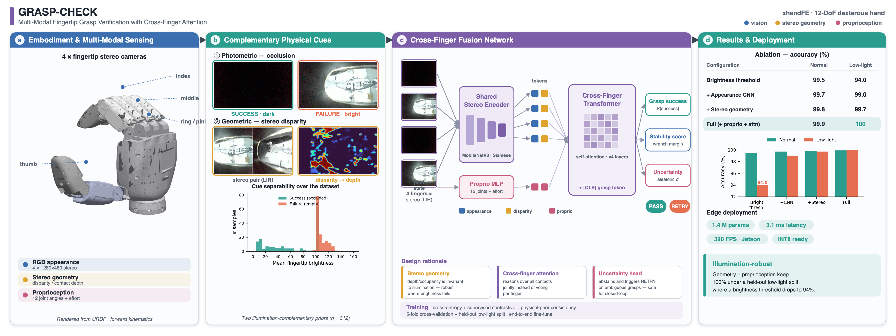
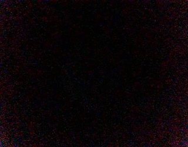
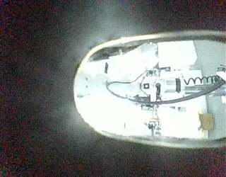
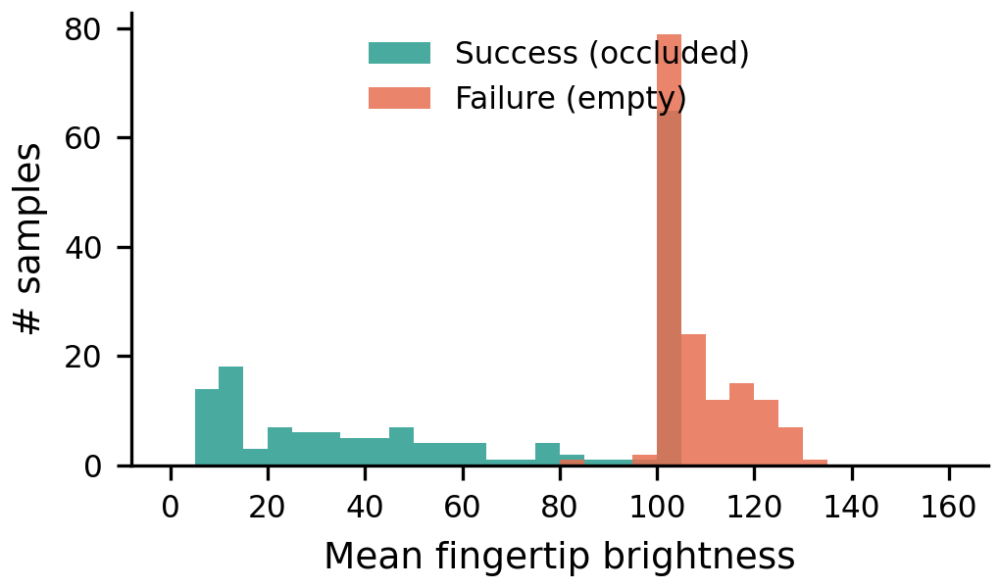
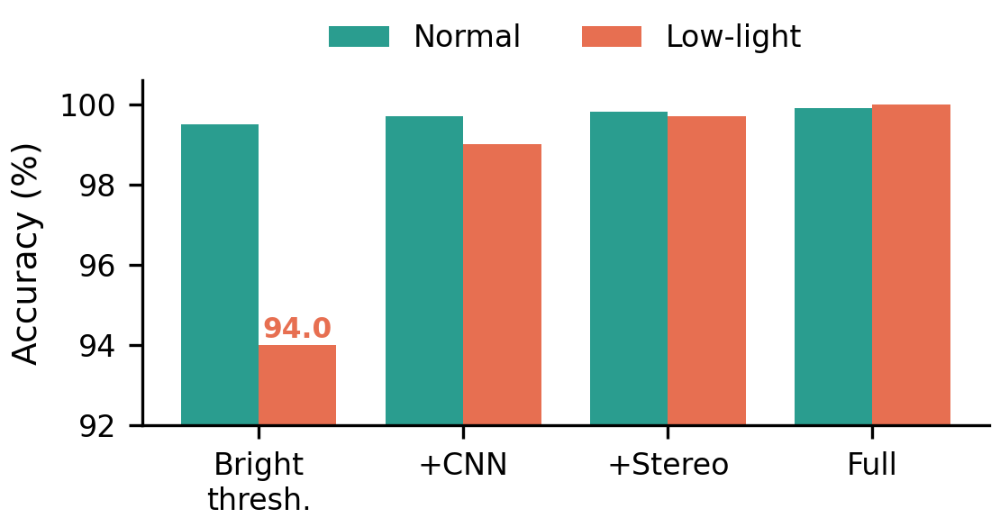
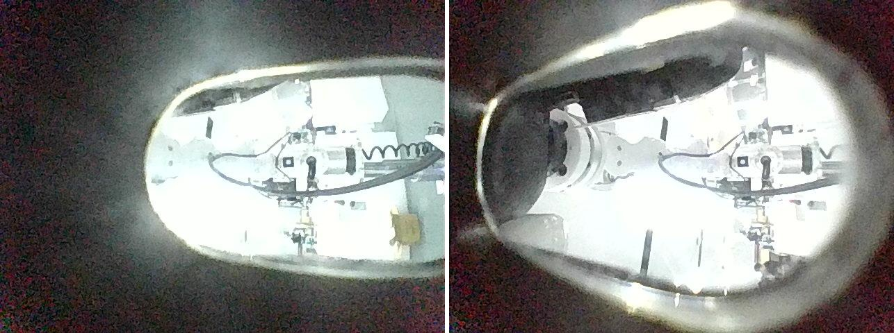
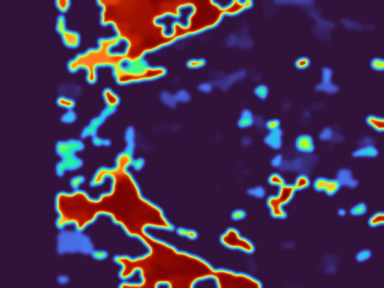

<div align="center">

# Illumination-Robust Grasp Verification from Fingertip Cameras

[](https://github.com/liangjlei/personalwebsite/tree/main/projects/finger-camera-grasp-verification)
[](#reproducibility)
[](#approach)
[](#real-robot-deployment)
[](#real-robot-deployment)
[](#license)

**A compact, illumination-robust binary classifier that decides whether a
dexterous hand is actually holding an object — from the view of its fingertip
cameras — and runs in real time on the robot.**

</div>

**Jinglei Liang** &middot; Embodied AI / robot perception, 2026

Grasp verification answers a deceptively simple closed-loop question: *did the
grasp succeed, or is the hand closing on empty space?* On a 12-DoF `xhandFE`
dexterous hand, each fingertip carries a small camera, and the answer turns out
to be written directly into those images by the physics of contact. This project
turns that observation into a deployed `SUCCESS` / `FAILURE` detector, benchmarks
three modelling choices against each other under a strict cross-illumination
protocol, and ships the winner as a TensorRT engine running on a Jetson AGX Thor.

<p align="center">
  
</p>

> **About this figure.** The four-panel diagram above is the *full multi-modal
> system design* — stereo-geometry and proprioception branches, a cross-finger
> attention module, and an aleatoric-uncertainty head that can abstain and
> trigger a re-grasp. The **deployed, validated baseline** described in the rest
> of this page is the appearance-only MobileNetV3 classifier (panel&nbsp;c, blue
> path). The richer fusion model is the roadmap; the numbers reported below are
> measured on the baseline that is actually running on hardware.

## The physical prior

All three methods studied here share one observation about fingertip-camera
imagery:

- **A successful grasp occludes the camera.** The held object sits between the
  fingers, blocking both the field of view and the ambient light source — the
  image goes **dark**, with little texture or edge content.
- **A failed grasp sees the world.** With nothing in hand, the fingertip camera
  looks out at the open workbench and the opposing fingers — the image is
  **bright**, with high edge density.

<p align="center">
  
  &nbsp;&nbsp;
  
  &nbsp;&nbsp;
  
</p>
<p align="center"><sub><b>Left to right:</b> success (occluded, dark) &middot; failure (empty, bright) &middot; mean-brightness separability across the dataset.</sub></p>

The brightness histogram makes the prior concrete — and also exposes its weak
point. The two classes separate cleanly *at a fixed illumination*, but the
decision boundary is an **absolute** brightness value. Halve the ambient light
and the failure mode lands squarely inside the success region. Everything
interesting about this project lives in that fragility.

## Dataset & evaluation protocol

| | |
|---|---|
| **Hand** | `xhandFE` 12-DoF dexterous hand, four fingertip cameras (`right_camera_{1..4}`) |
| **Data** | **382 grasps** — 312 normal-light (159 success / 153 failure) + 70 held-out low-light (35 / 35) |
| **Task** | Binary classification, `SUCCESS` = positive class |
| **Hardware** | Apple M3 for training/benchmarks; NVIDIA Jetson AGX Thor for deployment |

There is no single fixed test split. Instead, two protocols each answer a
different question, and all methods are evaluated under identical splits for a
fair comparison:

- **Protocol A — 5-fold cross-validation** (normal-light accuracy). The 312
  normal-light grasps are shuffled and partitioned into 5 folds; each fold is
  held out for testing once. Every grasp is predicted exactly once on a model
  that never saw it. No validation set is used for tuning — each fold trains for
  a fixed budget — so there is no information leakage.
- **Protocol B — cross-illumination hold-out** (robustness). Train on **all 312
  normal-light** grasps; test on **all 70 low-light** grasps. The model never
  sees low light during training — this measures generalization to a genuinely
  new illumination regime.

## Approach

Three models, increasing in capacity and decreasing in interpretability:

| # | Method | Idea | Params | Interpretable |
|---|--------|------|:------:|:-------------:|
| 1 | **CV-v2 — fixed threshold** | Bright-pixel ratio of the thumb camera; `< 0.082 → SUCCESS` | 1 threshold | ✅ fully |
| 2 | **Fusion MLP** | 21-D hand-crafted feature vector over 4 cameras (bright-pixel ratio, texture σ, edge density, mean brightness + scene-level cues) | ~1.2 K | ◑ partly |
| 3 | **MobileNetV3-Small CNN** | Thumb-camera ROI fed end-to-end to an ImageNet-pretrained CNN, fully fine-tuned | ~1.5 M | ✗ opaque |

The fusion MLP is the principled middle ground: its features are deliberately
**illumination-normalized** — e.g. `thumb_bright / scene-mean-brightness`, and a
multi-camera brightness-consistency cue — so that, in theory, it should resist
the absolute-brightness trap that sinks the fixed threshold.

## Results

### Normal light — 5-fold cross-validation

| Method | Protocol | Accuracy | Precision | Recall | Confusion |
|--------|----------|:--------:|:---------:|:------:|-----------|
| CV-v2 fixed threshold | full-set calibration | 98.1% | 1.000 | 0.962 | FN=6, FP=0 |
| Fusion MLP | 5-fold (held-out) | 99.4% ± 1.3% | 1.000 | 0.987 | FN=2, FP=0 |
| **MobileNetV3** | **5-fold (held-out)** | **99.7% ± 0.6%** | 1.000 | 0.994 | FN=1, FP=0 |

Under normal light, all three are near the ceiling and every learned model is
**zero-false-positive** — none ever reports a held grasp when the hand is empty,
which is the safe failure direction for downstream control. Normal light does
not discriminate between the methods.

### Cross-illumination — train on normal light, test on held-out low light

This is the experiment that separates the field:

| Method | Low-light accuracy | Precision | Recall | Confusion |
|--------|:------------------:|:---------:|:------:|-----------|
| CV-v2 fixed threshold | 87.1% | 0.795 | 1.000 | **FP=9**, FN=0 |
| Fusion MLP | 88.6% | 0.814 | 1.000 | **FP=8**, FN=0 |
| **MobileNetV3** | **100%** | **1.000** | **1.000** | **FP=0, FN=0** |

<p align="center">
  
</p>

### Reading the result

1. **The fixed-threshold low-light failure is real and systematic.** Low light
   compresses overall brightness by roughly half, pushing failure samples into
   the `SUCCESS` band that was calibrated for normal light. All 9 errors are
   false positives (empty grasp called a success). Re-tuning the threshold does
   not fix it — the *judgment criterion itself* is wrong.
2. **Hand-crafted normalization is not enough on its own.** Despite
   illumination-normalized features, the fusion MLP only edges out the fixed
   threshold (+1.5 pt) when it has never seen low light. Once a *few* low-light
   samples enter training, a merged 5-fold reaches **98.7%** — so the MLP needs
   to *see* the target illumination distribution rather than extrapolate to it.
3. **End-to-end CNN features extrapolate best.** Trained only on normal light,
   MobileNetV3 hits **100%** on the held-out low-light set with zero errors. The
   invariances a CNN learns from raw pixels generalize across illumination
   better than hand-designed normalization — at the cost of ~1.5 M weights and a
   `torch` dependency.

### Ablation — full fine-tuning vs. linear probing

Is full fine-tuning worth it for a model this small? Under a stratified
(source × label) split (3 seeds × 30 epochs), **both** full fine-tuning
(1,519,906 trainable params) and a frozen-backbone linear probe (592,898 params)
reach **100% ± 0.0** on in-distribution validation. The honest reading: this
does *not* prove fine-tuning is better — it shows `SUCCESS`/`FAILURE` is already
near-linearly separable in ImageNet feature space, so the task's high
separability masks any difference. A true verdict needs an **out-of-distribution
test set** (different lighting / background / objects / mounts) that does not yet
exist. Full fine-tuning is reported as the safe default, not as a measured win.

## Real-robot deployment

The MobileNetV3 classifier was exported to ONNX and compiled with
`trtexec --fp16` into a TensorRT engine on a **Jetson AGX Thor** (TensorRT
10.13.2), then run live on the thumb fingertip-camera stream.

| Metric | Value |
|--------|-------|
| End-to-end per frame (pre-process + H2D + infer + D2H) | **5.90 ms ≈ 169 FPS** |
| Pure GPU inference (H2D + infer + D2H) | **0.81 ms** (p50 0.77, p95 0.99) |
| Camera frame rate | 30 FPS (33.3 ms / frame) |
| Drop / empty-close → `FAILURE` latency | **≤ 40 ms**, no temporal filtering |

Inference is far faster than the camera frame period, so detection never backs
up: when an object slips or the gripper closes on air, the label flips to
`FAILURE` on the very next frame — no post-processing or time-window smoothing
required.

**Object-level field test (7 everyday items): 6 / 7 correct.** The single error
was a **false positive on a transparent water cup**: a transparent body barely
occludes the background, its thin grasped section fills little of the ROI, and
strong specular highlights differ from the diffuse-reflectance stainless steel in
training — so the model maps "no clear object surface" to `FAILURE`. The fix is a
data fix: add transparent containers (varied backgrounds and lighting) to the
training set and re-test. A diffuse stainless steel flask, by contrast, passed.

## Selection guidance

- **Variable lighting, robustness-critical, on-device compute available →
  MobileNetV3.** The only method that truly solves cross-illumination (100%).
- **Ultra-lightweight / interpretable, and you can sample the deployment
  lighting → fusion MLP.** ~1.2 K params, pure NumPy, zero false positives,
  98.7% once low light is in training.
- **Controlled, constant illumination → the fixed threshold is enough** (98.1%),
  with a single explainable parameter.

## Reproducibility

```bash
pip install torch torchvision opencv-python numpy

# traditional CV baseline (no training)
python grasp_check_cv_v2.py

# train the CNN classifier
python train_grasp_classifier.py --epochs 20

# ablations
python cnn_normal_cv.py                 # CNN 5-fold cross-validation
python compare_finetune_vs_probe.py     # full fine-tune vs linear probe
python compare_cross_illumination.py    # cross-illumination robustness
```

| File | Purpose |
|------|---------|
| `grasp_check_cv_v2.py` | OpenCV fixed-threshold baseline |
| `grasp_check_classifier.py` | MobileNetV3 model + dataset definition |
| `train_grasp_classifier.py` | Training script |
| `grasp_mlp_fusion.py` | Multi-camera fusion MLP (incl. both CV protocols) |
| `compare_cross_illumination.py` | Cross-illumination robustness test |
| `compare_finetune_vs_probe.py` | Full fine-tune vs. linear-probe ablation |

## Stereo & multi-modal roadmap

Beyond appearance, each fingertip pair provides **stereo geometry**: disparity
and contact depth are *invariant to illumination* exactly where brightness fails.

<p align="center">
  
  &nbsp;&nbsp;
  
</p>

The full system figure at the top of this page fuses three channels — appearance,
stereo geometry, and proprioception (12 joint angles + effort) — through a shared
Siamese encoder and a cross-finger Transformer, with a grasp-success head, a
stability-margin head, and an uncertainty head that can abstain and request a
re-grasp. That is the research direction; the deployed baseline above is the
foundation it builds on.

## License

MIT License.

---

<sub>A personal robot-perception project: closed-loop grasp verification from
fingertip cameras, studied as a controlled comparison of a classical threshold,
a hand-crafted-feature MLP, and an end-to-end CNN, and validated on real hardware
with a TensorRT deployment on Jetson AGX Thor.</sub>
