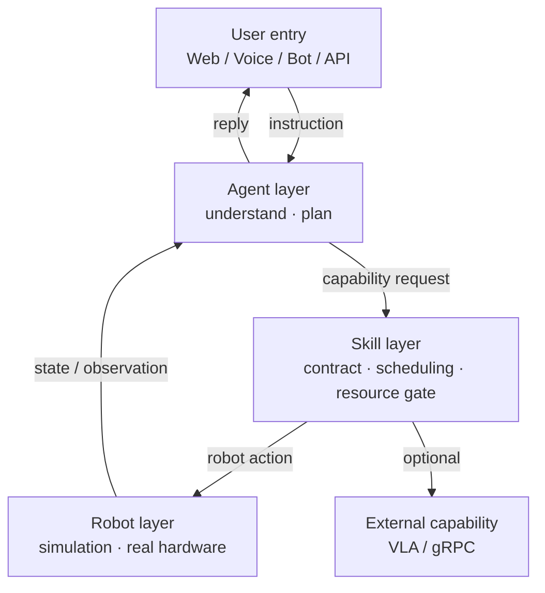

<div align="center">

# OpenRobot

[](https://github.com/liangjlei/personalwebsite/tree/main/projects/openrobot)
[](#tech-stack)
[](#license)
[](#llm-driven)
[](#ros2-support)
[](#multi-entry-interaction)

**An open-source, LLM-driven robot framework that closes the loop from
natural-language instruction to real robot execution.**

</div>

**Jinglei Liang** &middot; Embodied AI / LLM agents, 2026

OpenRobot is an open framework for service robots, manipulator arms, and mobile
robots. A user issues a task in natural language; a large language model handles
task understanding and planning, then invokes robot skills to execute it, and
finally feeds the result back to the user — a complete **AI Agent + Robot** loop.

It is built to serve as:

- 🤖 an AI-robotics learning project
- 🦾 a manipulator-control demo
- 🧠 an LLM-agent practice ground
- 🏠 a home service-robot base
- 🏭 an industrial-robot validation platform

## Pipeline

```
User input
    │
    ▼
Natural-language understanding (LLM)
    │
    ▼
Task planning (Planner)
    │
    ▼
Skill invocation (Skills)
    │
    ▼
Robot control (Robot Controller)
    │
    ▼
Manipulator execution
    │
    ▼
State feedback ──► (back to the agent)
```

End-to-end flow:

```
Human → LLM → Task Planner → Skill Executor → Robot SDK → Real Robot
```

The agent only requests *capabilities*; it never drives hardware directly. A
skill layer sits between reasoning and motion so that planning, scheduling,
resource gating, and recovery all stay decoupled from the robot driver.

## Features

### LLM-driven

Pluggable language-model backends:

- GPT
- Qwen
- DeepSeek
- GLM
- Llama

### Multi-entry interaction

The same runtime is reachable through:

- Web
- API
- Voice
- Telegram
- Feishu (Lark) bot

### Extensible skills

Adding a new capability is just a new file under `skills/` — it is registered
automatically:

```
skills/
    move.py
    pick.py
    place.py
    vision.py
```

### ROS2 support

- ROS2
- MoveIt2
- Nav2
- Gazebo

## Architecture

The full stack, from model inputs and outputs through the layered runtime to
sim-to-real deployment:


The same boundaries expressed as a flow:



Core boundaries:

- **Robot** represents only the body and the hardware-execution boundary.
- **Skill** is the single entry through which the agent calls robot capabilities.
- The agent invokes skills via `request_capability` and never submits a raw
  robot action.
- Robot / perception services own observation streams and camera-frame publishing.
- Foundation-model capabilities (VLA / VLN / WAM) attach through a separate
  capability service rather than being wired into the driver.

## Recommended layout

```
OpenRobot
│
├── docs
├── examples
├── skills
│   ├── pick.py
│   ├── place.py
│   ├── move.py
│   └── vision.py
│
├── planner
│   ├── planner.py
│   └── prompt.py
│
├── llm
│   ├── openai.py
│   ├── qwen.py
│   └── deepseek.py
│
├── robot
│   ├── arm.py
│   ├── base.py
│   ├── camera.py
│   └── sdk.py
│
├── web
├── api
├── config
├── README.md
└── requirements.txt
```

## Tech stack

Python · FastAPI · ROS2 · MoveIt2 · OpenCV · YOLO · LangChain (optional) ·
OpenAI SDK · Qwen · DeepSeek · Docker

## Quick start

```bash
# install dependencies
pip install -r requirements.txt

# configure the LLM provider / robot backend
cp config/example.env .env

# launch in simulation (no hardware required)
python -m openrobot.run --config config/sim.yaml
```

The default web entry is served at `http://127.0.0.1:8080`. Simulation is the
right place to validate the agent, skills, web cockpit, and the execution chain
before touching real hardware.

## Safety

This project can issue motion commands to real robot hardware:

- Validate in simulation before connecting real hardware.
- Keep an emergency stop or power cut-off available during real-robot runs.
- Do not test motion skills near people, pets, fragile objects, or unstable setups.
- Re-run diagnostics after changing hardware, serial ports, servo IDs, or camera indices.
- Verify foundation-model (VLA) capabilities independently before exposing them to the agent.

## License

MIT License.

---

<sub>OpenRobot is a personal engineering project on LLM-driven robot control —
turning natural-language tasks into planned, skill-level robot execution with
closed-loop feedback. It draws on hands-on practice with open robot platforms
and agent runtimes.</sub>
